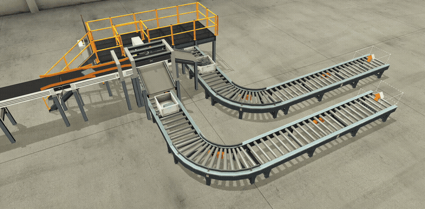
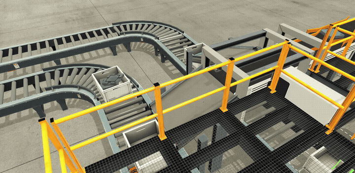
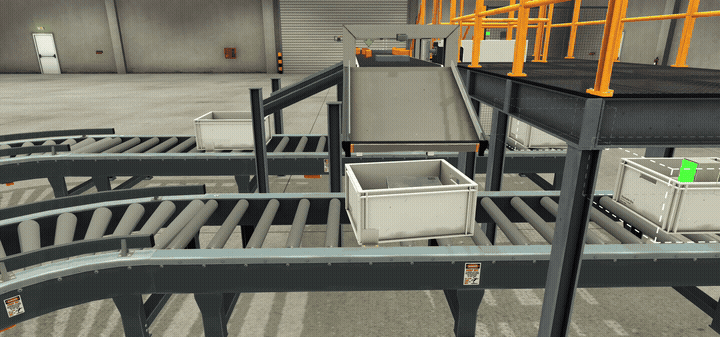

# 🏭 Automated Sorting Cell

> Industrial automation project simulating a complete sorting cell for metal and plastic parts — built as a portfolio project demonstrating mechatronics and industrial automation skills.

---

Demo

Top View


Platform View


Conveyor End


---

📌 About
This project simulates a fully automated industrial sorting cell capable of identifying and separating metal and plastic parts using inductive and capacitive sensors. The system controls conveyors, a pneumatic actuator, box counting, and automatic box exchange — all programmed using PLC logic in Control I/O and simulated in Factory I/O.

---

How It Works

1. Emitte releases parts (metal or plastic) onto the main conveyor
2. Parts pass through inductive + capacitive sensors:
   - Both sensors detect → Metal → continues straight → falls into metal box
   - Only capacitive detects → Plastic → pneumatic pusher activates → falls into plastic box
3. Each box holds 5 parts
4. When full, the box conveyor advances automatically, waits for a new box, then resumes
5. Main conveyor pauses during:
   - Plastic ejection (pusher active)
   - Box exchange (no box present under ramp)

---

Features

- PLC logic programming (Ladder / Control I/O)
- Inductive and capacitive sensor-based detection
- Pneumatic actuator control with automatic return
- Automatic part counting per box (CTU counter)
- Timed box advance (TON timer)
- Conveyor pause during box change and plastic ejection
- Emergency stop and Start/Stop control panel
- CAD design — parts, structure and full cell layout
- Technical documentation with revision block

---

Tools & Technologies

| Area | Tools |
|------|-------|
| Simulation | Factory I/O |
| PLC Logic | Control I/O |
| CAD | AutoCAD / SolidWorks |
| Documentation | Technical Drawing (PDF) |

---

Project Structure

```
Automated-sorting-cell/
├── images/
│   ├── demo_1.gif
│   ├── demo_2.gif
│   └── demo_3.gif
├── docs/
│   └── AUTOMATED_PLATE_SORTING_SYSTEM.pdf
└── README.md
```

---

Technical Documentation

📐 📐 [Technical Drawing](docs/AUTOMATED_PLATE_SORTING_SYSTEM.pdf)

Includes:
- Side Elevation & Layout Plan (Scale 1:20)
- Plant Layout (Scale 1:40)
- Component list
- Revision block

---

Skills Demonstrated

`Industrial Automation` `PLC Programming` `Ladder Logic` `Sensor Integration` `Pneumatic Control` `CAD Design` `Process Control` `Technical Documentation` `Mechatronics`

---

👥 Contributors

| [](https://github.com/huryelprofissional-design) | [](https://github.com/Pedro_Espinhola) |
|---|---|
| [Huryel Aroucca](https://github.com/huryelprofissional-design) | [Pedro Espinhola](https://github.com/Pedro_Espinhola) |
| Automation & PLC Logic | CAD & Mechanical Design |

---

📬 Contact

- **Huryel Aroucca** — [LinkedIn](https://linkedin.com/in/huryel-aroucca-profissional) · huryelprofissional@gmail.com
- **Pedro Espinhola** — pedrohenriquemachadoespindolah@gmail.com

---

<p align="center">
  Made with ❤️ by <strong>IGENOVA Engineering</strong>
</p>
